# Technical Design Document (TDD)
## Databricks ETL Pipeline for Sales & Marketing Data Processing

**Document Version**: 1.0
**Date**: 2026-02-18
**Status**: Draft
**Target Catalog**: `zoltan-verebes-catalog-m`
**Target Schema**: `dg-day`

---

## Table of Contents

1. [Architecture Overview](#architecture-overview)
2. [Unity Catalog Structure](#unity-catalog-structure)
3. [Data Flow Summary](#data-flow-summary)
4. [Data Sources & Analysis](#data-sources--analysis)
5. [Unity Catalog Object Definitions](#unity-catalog-object-definitions)
6. [Medallion Architecture Implementation](#medallion-architecture-implementation)
7. [Data Governance & Security](#data-governance--security)
8. [Deployment Architecture & Process](#deployment-architecture--process)
9. [Databricks Environment Configuration](#databricks-environment-configuration)

---

## Architecture Overview

### System Architecture Diagram


### Data Flow Architecture

```mermaid
graph TD
    subgraph "Source Layer"
        S1["📄 customers.csv"]
        S2["📄 sales.csv"]
        S3["📄 sales_orders.csv"]
    end

    subgraph "Bronze Layer (Raw Data)"
        B1["bronze_customers_raw"]
        B2["bronze_sales_raw"]
        B3["bronze_sales_orders_raw"]
    end

    subgraph "Silver Layer (Cleaned Data)"
        SL1["silver_customers"]
        SL2["silver_sales"]
        SL3["silver_sales_orders"]
    end

    subgraph "Gold Layer (Business Layer)"
        G1["gold_sales_reporting"]
        G2["gold_marketing_campaigns"]
    end

    subgraph "Downstream Systems"
        D1["📊 BI Dashboards"]
        D2["🔗 Marketing API"]
    end

    S1 --> B1 --> SL1 --> G1 --> D1
    S2 --> B2 --> SL2 --> G1
    S3 --> B3 --> SL3 --> G1

    SL1 --> G2 --> D2
    SL2 --> G2
    SL3 --> G2

    style S1 fill:#e1f5ff
    style S2 fill:#e1f5ff
    style S3 fill:#e1f5ff
    style B1 fill:#fff3e0
    style B2 fill:#fff3e0
    style B3 fill:#fff3e0
    style SL1 fill:#f3e5f5
    style SL2 fill:#f3e5f5
    style SL3 fill:#f3e5f5
    style G1 fill:#c8e6c9
    style G2 fill:#c8e6c9
    style D1 fill:#b3e5fc
    style D2 fill:#b3e5fc
```



### Layers Overview

| Layer | Purpose | Data Quality | Retention | Access Pattern |
|-------|---------|--------------|-----------|-----------------|
| **Source** | External CSV files in Unity Catalog Volume | Raw, unvalidated | N/A (external) | Batch read |
| **Bronze** | Raw data ingestion with minimal transformation | As-is from source | 90 days | Internal tables |
| **Silver** | Cleaned, validated, deduplicated data | Validated, normalized | 1 year | Standard queries |
| **Gold** | Business-ready aggregations and denormalized facts | Aggregated, business-logic applied | 2 years | Dashboard & API |

---

## Unity Catalog Structure

### Workspace Configuration

- **Workspace URL**: `https://dbc-59bc96e6-d850.cloud.databricks.com`
- **Catalog**: `zoltan-verebes-catalog-m`
- **Schema**: `dg-day`
- **Source Volume**: `/Volumes/zoltan-verebes-catalog-m/dg-day/volume/`

### Naming Convention

**Pattern**: `{layer}_{domain}_{entity_type}`

Where:
- **layer**: `bronze` | `silver` | `gold`
- **domain**: `customers` | `sales` | `orders`
- **entity_type**: `raw` | `dim` | `fact` | `summary` (optional)

**Examples**:
- `bronze_customers_raw` - Raw customer data from source
- `silver_customers_dim` - Cleaned customer dimension
- `gold_sales_summary` - Aggregated sales metrics
- `gold_marketing_campaigns` - Marketing automation dataset

### Schema Structure

```
Catalog: zoltan-verebes-catalog-m
└── Schema: dg-day
    ├── Bronze Tables (raw)
    │   ├── bronze_customers_raw
    │   ├── bronze_sales_raw
    │   └── bronze_sales_orders_raw
    │
    ├── Silver Tables (cleaned)
    │   ├── silver_customers_dim
    │   ├── silver_sales_fact
    │   └── silver_sales_orders_fact
    │
    ├── Gold Tables (aggregations)
    │   ├── gold_sales_reporting
    │   ├── gold_marketing_campaigns
    │   └── gold_customer_product_segments
    │
    └── Staging & Views
        ├── _staging_customer_orders (temp view)
        └── _staging_campaign_ready (temp view)
```

---

## Data Flow Summary

### Bronze Layer: Raw Data Ingestion

**Objective**: Ingest source CSV files as-is with minimal transformation
**Method**: Auto-loader or manual batch reads
**Key Tasks**:
- Read CSV files from Unity Catalog Volume
- Apply schema validation
- Add ingestion metadata (load_timestamp, source_file, load_id)
- Store in Delta format for ACID compliance

### Silver Layer: Data Cleaning & Standardization

**Objective**: Clean, deduplicate, and standardize data for analysis
**Key Tasks**:
- Remove duplicates
- Standardize data types and formats
- Handle NULL/missing values
- Validate referential integrity
- Enrich with business logic (e.g., timezone mapping)
- Create conformed dimensions

### Gold Layer: Business Aggregations

**Objective**: Create business-ready datasets for specific use cases
**Use Case 1 - Sales Reporting**:
- Aggregate sales by time dimensions (daily, weekly, monthly, annual)
- Aggregate by product and product category
- Calculate metrics: revenue, order count, average order value
- Exclude PII data

**Use Case 2 - Marketing Campaigns**:
- Customer-level aggregations (orders, spend, last purchase)
- Product category segmentation
- Include PII with restricted access
- Filter for valid contact information (email or phone)
- Add timezone mapping for call center optimization

---

## Data Sources & Analysis

### Source 1: customers.csv

**Location**: `/Volumes/zoltan-verebes-catalog-m/dg-day/volume/customers.csv`
**Format**: CSV with header
**Update Pattern**: Batch, manual trigger
**Expected Characteristics**: Master customer reference data

#### Sample Data

| customer_id | tax_id | tax_code | customer_name | state | city | postcode | street | number | unit | region | district | lon | lat | ship_to_address | valid_from | valid_to | units_purchased | loyalty_segment |
|---|---|---|---|---|---|---|---|---|---|---|---|---|---|---|---|---|---|---|
| 30930809 | NULL | NULL | GALVAN, MARK E | OR | PORTLAND | 97232 | NE GLISAN ST | 1608 | NULL | OR | MULTNOMAH | -122.649 | 45.5264 | OR, 97232.0, NE GLISAN ST, 1608 | 1514970078 | NULL | 3 | 0 |

#### Schema Analysis

| Attribute | Data Type | Nullable | PII | Purpose | Notes |
|-----------|-----------|----------|-----|---------|-------|
| customer_id | BIGINT | No | No | Primary Key | Unique customer identifier |
| tax_id | STRING | Yes | No | Compliance | Tax identification number |
| tax_code | STRING | Yes | No | Compliance | Tax classification code |
| customer_name | STRING | No | Yes | Identity | Customer full name - PII |
| state | STRING | No | No | Location | US state abbreviation |
| city | STRING | No | No | Location | City name |
| postcode | BIGINT | No | No | Location | Postal code |
| street | STRING | No | No | Location | Street name |
| number | STRING | Yes | No | Location | Street number (can be alphanumeric) |
| unit | STRING | Yes | No | Location | Apartment/unit number |
| region | STRING | No | No | Location | Region identifier |
| district | STRING | Yes | No | Location | District/county name |
| lon | DOUBLE | No | No | Geolocation | Longitude coordinate |
| lat | DOUBLE | No | No | Geolocation | Latitude coordinate |
| ship_to_address | STRING | No | No | Fulfillment | Formatted shipping address |
| valid_from | BIGINT | No | No | Metadata | Validity start timestamp (Unix) |
| valid_to | STRING | Yes | No | Metadata | Validity end timestamp (NULL if current) |
| units_purchased | BIGINT | No | No | Business | Total units purchased by customer |
| loyalty_segment | BIGINT | No | No | Business | Loyalty tier (0-3) |

#### Key Constraints

- **Primary Key**: `customer_id`
- **NOT NULL Columns**: customer_id, customer_name, state, city, postcode, street, region, lon, lat, ship_to_address, valid_from, units_purchased, loyalty_segment
- **Nullable Columns**: tax_id, tax_code, unit, district, valid_to
- **Data Quality Notes**:
  - valid_to can be NULL (indicates active customer)
  - street_number is STRING to handle alphanumeric values
  - Coordinates should be validated for valid range

---

### Source 2: sales.csv

**Location**: `/Volumes/zoltan-verebes-catalog-m/dg-day/volume/sales.csv`
**Format**: CSV with header
**Update Pattern**: Batch, manual trigger (daily expected after implementation)
**Expected Characteristics**: Transaction/order data with product details

#### Sample Data

| customer_id | customer_name | product_name | order_date | product_category | product | total_price |
|---|---|---|---|---|---|---|
| 20007428 | autotech industries | Ramsung - 960 Pro 1TB Internal PCI Express 3.0 x4 (NVMe 1.1) Solid State Drive | 2019-10-10 | Ramsung | {"curr":"USD", "id":"AVpfAXof1cnluZ0-bz3u"} | ... |

#### Schema Analysis

| Attribute | Data Type | Nullable | PII | Purpose | Notes |
|-----------|-----------|----------|-----|---------|-------|
| customer_id | BIGINT | No | No | Foreign Key | References customers.customer_id |
| customer_name | STRING | No | Yes | Identity | Customer name - PII |
| product_name | STRING | No | No | Product | Full product description |
| order_date | STRING | No | No | Business | Date of order (YYYY-MM-DD format) |
| product_category | STRING | No | No | Business | Product category for segmentation |
| product | STRING | No | No | Product | JSON-encoded product metadata |
| total_price | DECIMAL(10,2) | No | No | Business | Order total amount |

#### Key Constraints

- **Primary Key**: None (fact table allows multiple records per customer)
- **Foreign Key**: `customer_id` → `customers.customer_id`
- **NOT NULL Columns**: All columns are NOT NULL
- **Data Quality Notes**:
  - product is JSON-encoded; needs parsing in Silver layer
  - order_date should be cast to DATE type
  - total_price should be validated for positive values

---

### Source 3: sales_orders.csv

**Location**: `/Volumes/zoltan-verebes-catalog-m/dg-day/volume/sales_orders.csv`
**Format**: CSV with header
**Update Pattern**: Batch, manual trigger (daily expected after implementation)
**Expected Characteristics**: Line-item level order details with complex structures

#### Sample Data

| clicked_items | customer_id | customer_name | number_of_line_items | order_datetime | order_number | ordered_products | promo_info |
|---|---|---|---|---|---|---|---|
| [["AVpffrToLJeJML43-M2g", "70"]] | 18983382 | LASAK, KEVIN S | 1 | 317571660 | ... | 82 | [{"curr":"USD"... |

#### Schema Analysis

| Attribute | Data Type | Nullable | PII | Purpose | Notes |
|-----------|-----------|----------|-----|---------|-------|
| clicked_items | STRING | No | No | Behavior | JSON array of clicked product IDs |
| customer_id | BIGINT | No | No | Foreign Key | References customers.customer_id |
| customer_name | STRING | No | Yes | Identity | Customer name - PII |
| number_of_line_items | BIGINT | No | No | Business | Count of items in order |
| order_datetime | BIGINT | No | No | Business | Order timestamp (Unix) |
| order_number | STRING | No | No | Business | Unique order reference |
| ordered_products | STRING | No | No | Business | JSON array of ordered product IDs |
| promo_info | STRING | Yes | No | Business | Promotion/discount details as JSON |

#### Key Constraints

- **Primary Key**: `order_number` (assumed unique)
- **Foreign Key**: `customer_id` → `customers.customer_id`
- **Nullable Columns**: promo_info
- **Data Quality Notes**:
  - clicked_items and ordered_products are JSON arrays; need parsing
  - order_datetime is Unix timestamp; should be cast to TIMESTAMP
  - Complex nested structures require careful parsing

---

## Unity Catalog Object Definitions

### Bronze Layer Tables

#### bronze_customers_raw

**Type**: Managed Table (Delta)
**Purpose**: Raw ingestion of customer master data from source CSV
**Retention Policy**: 90 days
**Clustering**: customer_id (for performance)

**DDL Specification**:
```sql
CREATE TABLE IF NOT EXISTS zoltan-verebes-catalog-m.dg-day.bronze_customers_raw (
    customer_id BIGINT NOT NULL,
    tax_id STRING,
    tax_code STRING,
    customer_name STRING NOT NULL,
    state STRING NOT NULL,
    city STRING NOT NULL,
    postcode BIGINT NOT NULL,
    street STRING NOT NULL,
    number STRING,
    unit STRING,
    region STRING NOT NULL,
    district STRING,
    lon DOUBLE NOT NULL,
    lat DOUBLE NOT NULL,
    ship_to_address STRING NOT NULL,
    valid_from BIGINT NOT NULL,
    valid_to STRING,
    units_purchased BIGINT NOT NULL,
    loyalty_segment BIGINT NOT NULL,
    -- Ingestion metadata
    _load_timestamp TIMESTAMP NOT NULL COMMENT 'Timestamp when record was loaded',
    _load_id STRING NOT NULL COMMENT 'Unique load batch identifier',
    _source_file STRING NOT NULL COMMENT 'Source CSV file path'
)
USING DELTA
COMMENT 'Raw customer master data from source CSV'
TBLPROPERTIES (
    'delta.dataChange' = 'true',
    'classification' = 'Internal',
    'retention_days' = '90',
    'layer' = 'bronze'
);
```

**Column Comments**:
- `customer_id`: Unique customer identifier from source
- `customer_name`: Customer full name for identification
- `state`: US state for customer location
- `valid_from`: Effective start date (Unix timestamp)
- `valid_to`: Effective end date (NULL if current)
- `_load_timestamp`: Pipeline ingestion timestamp
- `_load_id`: Batch identifier for auditing
- `_source_file`: Source file path for lineage tracking

---

#### bronze_sales_raw

**Type**: Managed Table (Delta)
**Purpose**: Raw ingestion of order/sales transaction data
**Retention Policy**: 90 days
**Partitioning**: order_date (daily partitions)

**DDL Specification**:
```sql
CREATE TABLE IF NOT EXISTS zoltan-verebes-catalog-m.dg-day.bronze_sales_raw (
    customer_id BIGINT NOT NULL,
    customer_name STRING NOT NULL,
    product_name STRING NOT NULL,
    order_date STRING NOT NULL,
    product_category STRING NOT NULL,
    product STRING NOT NULL,
    total_price DECIMAL(18, 4) NOT NULL,
    -- Ingestion metadata
    _load_timestamp TIMESTAMP NOT NULL COMMENT 'Timestamp when record was loaded',
    _load_id STRING NOT NULL COMMENT 'Unique load batch identifier',
    _source_file STRING NOT NULL COMMENT 'Source CSV file path',
    _ingestion_date DATE GENERATED ALWAYS AS CAST(CAST(order_date AS DATE) AS DATE)
)
USING DELTA
PARTITIONED BY (_ingestion_date)
COMMENT 'Raw sales transaction data from source CSV'
TBLPROPERTIES (
    'delta.dataChange' = 'true',
    'classification' = 'Internal',
    'retention_days' = '90',
    'layer' = 'bronze'
);
```

**Column Comments**:
- `order_date`: Date of transaction (YYYY-MM-DD format)
- `product`: JSON-encoded product metadata (to be parsed in Silver layer)
- `total_price`: Order amount in decimal format
- `_ingestion_date`: Partitioning column for query optimization

---

#### bronze_sales_orders_raw

**Type**: Managed Table (Delta)
**Purpose**: Raw ingestion of line-item level order details
**Retention Policy**: 90 days
**Partitioning**: order_datetime

**DDL Specification**:
```sql
CREATE TABLE IF NOT EXISTS zoltan-verebes-catalog-m.dg-day.bronze_sales_orders_raw (
    clicked_items STRING NOT NULL,
    customer_id BIGINT NOT NULL,
    customer_name STRING NOT NULL,
    number_of_line_items BIGINT NOT NULL,
    order_datetime BIGINT NOT NULL,
    order_number STRING NOT NULL,
    ordered_products STRING NOT NULL,
    promo_info STRING,
    -- Ingestion metadata
    _load_timestamp TIMESTAMP NOT NULL COMMENT 'Timestamp when record was loaded',
    _load_id STRING NOT NULL COMMENT 'Unique load batch identifier',
    _source_file STRING NOT NULL COMMENT 'Source CSV file path'
)
USING DELTA
COMMENT 'Raw order line-item data with product and click tracking'
TBLPROPERTIES (
    'delta.dataChange' = 'true',
    'classification' = 'Internal',
    'retention_days' = '90',
    'layer' = 'bronze'
);
```

**Column Comments**:
- `clicked_items`: JSON array of product IDs clicked by customer
- `order_datetime`: Order timestamp in Unix epoch format
- `ordered_products`: JSON array of product IDs in order
- `promo_info`: JSON-encoded promotion details (nullable)

---

### Silver Layer Tables

#### silver_customers_dim

**Type**: Managed Table (Delta)
**Purpose**: Cleaned, deduplicated customer dimension
**Retention Policy**: 1 year
**Clustering**: customer_id

**Key Transformations**:
- Remove duplicates (keep latest valid_from)
- Standardize state codes
- Validate coordinates
- Parse timezone from state
- Handle NULL values with defaults

**DDL Specification**:
```sql
CREATE TABLE IF NOT EXISTS zoltan-verebes-catalog-m.dg-day.silver_customers_dim (
    customer_id BIGINT NOT NULL,
    customer_name STRING NOT NULL,
    state STRING NOT NULL,
    city STRING NOT NULL,
    postcode STRING NOT NULL,
    street_address STRING NOT NULL,
    lon DOUBLE NOT NULL,
    lat DOUBLE NOT NULL,
    timezone STRING NOT NULL COMMENT 'Derived from state',
    units_purchased BIGINT NOT NULL,
    loyalty_segment INT NOT NULL,
    -- Data quality flags
    is_active BOOLEAN NOT NULL COMMENT 'TRUE if valid_to is NULL',
    -- Metadata
    dbt_valid_from TIMESTAMP NOT NULL,
    dbt_valid_to TIMESTAMP,
    _source_row_hash STRING NOT NULL COMMENT 'Hash of source columns for change detection',
    _load_timestamp TIMESTAMP NOT NULL
)
USING DELTA
COMMENT 'Cleaned customer dimension with timezone enrichment'
TBLPROPERTIES (
    'classification' = 'Internal',
    'retention_days' = '365',
    'layer' = 'silver'
);
```

---

#### silver_sales_fact

**Type**: Managed Table (Delta)
**Purpose**: Cleaned sales transaction fact table
**Retention Policy**: 1 year
**Partitioning**: order_date

**Key Transformations**:
- Cast order_date to DATE type
- Parse product JSON and extract product_id
- Validate foreign key references to customer_id
- Handle negative/zero amounts as quality issues
- Calculate additional metrics (unit price, tax, discount)

**DDL Specification**:
```sql
CREATE TABLE IF NOT EXISTS zoltan-verebes-catalog-m.dg-day.silver_sales_fact (
    order_id STRING NOT NULL,
    customer_id BIGINT NOT NULL,
    product_id STRING NOT NULL,
    order_date DATE NOT NULL,
    product_category STRING NOT NULL,
    product_name STRING NOT NULL,
    quantity BIGINT NOT NULL DEFAULT 1,
    unit_price DECIMAL(18, 4) NOT NULL,
    total_price DECIMAL(18, 4) NOT NULL,
    -- Data quality
    is_valid_reference BOOLEAN NOT NULL,
    _data_quality_issues STRING,
    -- Metadata
    _load_timestamp TIMESTAMP NOT NULL
)
USING DELTA
PARTITIONED BY (order_date)
COMMENT 'Cleaned sales transaction facts with product details'
TBLPROPERTIES (
    'classification' = 'Internal',
    'retention_days' = '365',
    'layer' = 'silver'
);
```

---

#### silver_sales_orders_fact

**Type**: Managed Table (Delta)
**Purpose**: Cleaned order line-item details
**Retention Policy**: 1 year

**Key Transformations**:
- Cast order_datetime from Unix to TIMESTAMP
- Parse clicked_items and ordered_products JSON arrays
- Explode arrays to create row-per-product records
- Validate referential integrity
- Enrich with order metadata

**DDL Specification**:
```sql
CREATE TABLE IF NOT EXISTS zoltan-verebes-catalog-m.dg-day.silver_sales_orders_fact (
    order_number STRING NOT NULL,
    customer_id BIGINT NOT NULL,
    order_datetime TIMESTAMP NOT NULL,
    line_item_number INT NOT NULL,
    product_id STRING NOT NULL,
    is_clicked BOOLEAN NOT NULL,
    quantity_ordered INT NOT NULL,
    has_promotion BOOLEAN NOT NULL,
    promotion_code STRING,
    -- Metadata
    _load_timestamp TIMESTAMP NOT NULL
)
USING DELTA
COMMENT 'Cleaned order line-item details with product and interaction tracking'
TBLPROPERTIES (
    'classification' = 'Internal',
    'retention_days' = '365',
    'layer' = 'silver'
);
```

---

### Gold Layer Tables

#### gold_sales_reporting

**Type**: Managed Table (Delta)
**Purpose**: Pre-aggregated sales metrics for BI dashboards
**Retention Policy**: 2 years
**Partitioning**: year, month

**Aggregations**:
- BY: time_dimension (day, week, month, year), product_id, product_category
- METRICS: total_revenue, order_count, avg_order_value, units_sold
- NO PII DATA (customer details excluded)

**DDL Specification**:
```sql
CREATE TABLE IF NOT EXISTS zoltan-verebes-catalog-m.dg-day.gold_sales_reporting (
    -- Dimensions
    report_date DATE NOT NULL,
    year INT NOT NULL,
    month INT NOT NULL,
    week INT NOT NULL,
    day_of_week STRING NOT NULL,
    time_dimension STRING NOT NULL COMMENT 'daily|weekly|monthly|annual',
    product_id STRING NOT NULL,
    product_name STRING NOT NULL,
    product_category STRING NOT NULL,
    -- Metrics
    total_revenue DECIMAL(18, 2) NOT NULL,
    order_count BIGINT NOT NULL,
    avg_order_value DECIMAL(18, 4) NOT NULL,
    units_sold BIGINT NOT NULL,
    unique_customer_count INT NOT NULL,
    -- Metadata
    _load_timestamp TIMESTAMP NOT NULL,
    _data_freshness TIMESTAMP NOT NULL
)
USING DELTA
PARTITIONED BY (year, month)
COMMENT 'Pre-aggregated sales metrics for BI dashboards - PII EXCLUDED'
TBLPROPERTIES (
    'classification' = 'Public',
    'retention_days' = '730',
    'layer' = 'gold',
    'pii_columns' = 'none'
);
```

---

#### gold_marketing_campaigns

**Type**: Managed Table (Delta)
**Purpose**: Customer-level data for marketing automation with segmentation
**Retention Policy**: 2 years
**Retention**: Active customers only (weekly refresh)

**Customer-Level Aggregations**:
- customer_id, customer_name, email, phone, timezone
- products_purchased (array), product_categories (array)
- total_orders, total_spend, last_purchase_date
- loyalty_segment, preferred_contact_method

**Security**: Row-Level Security (RLS) for marketing team access only
**Data Access**: PII-included with restricted permissions

**DDL Specification**:
```sql
CREATE TABLE IF NOT EXISTS zoltan-verebes-catalog-m.dg-day.gold_marketing_campaigns (
    -- Customer Identification (PII)
    customer_id BIGINT NOT NULL,
    customer_name STRING NOT NULL COMMENT 'PII: Customer full name',
    email STRING NOT NULL COMMENT 'PII: Email address',
    phone STRING NOT NULL COMMENT 'PII: Phone number',
    -- Location & Contact
    state STRING NOT NULL,
    city STRING NOT NULL,
    timezone STRING NOT NULL,
    -- Behavioral Metrics
    total_orders BIGINT NOT NULL,
    total_spend DECIMAL(18, 2) NOT NULL,
    last_purchase_date DATE NOT NULL,
    avg_order_value DECIMAL(18, 4) NOT NULL,
    -- Product Segmentation
    products_purchased ARRAY<STRUCT<product_id STRING, product_name STRING>>,
    product_categories ARRAY<STRING> NOT NULL,
    primary_product_category STRING NOT NULL,
    -- Customer Classification
    loyalty_segment INT NOT NULL,
    is_active BOOLEAN NOT NULL,
    preferred_contact_method STRING COMMENT 'email|phone|both',
    -- Metadata
    segment_date DATE NOT NULL,
    _load_timestamp TIMESTAMP NOT NULL
)
USING DELTA
COMMENT 'Marketing automation dataset with customer segmentation - PII INCLUDED - RESTRICTED ACCESS'
TBLPROPERTIES (
    'classification' = 'Confidential',
    'retention_days' = '730',
    'layer' = 'gold',
    'pii_columns' = 'customer_name,email,phone',
    'row_security_enabled' = 'true',
    'authorized_groups' = 'marketing_team'
);
```

---

#### gold_customer_product_segments

**Type**: Managed View (derived from gold_marketing_campaigns)
**Purpose**: Customer segmentation by product category for targeted campaigns
**Retention Policy**: Current data only

**DDL Specification**:
```sql
CREATE OR REPLACE VIEW zoltan-verebes-catalog-m.dg-day.gold_customer_product_segments AS
SELECT
    customer_id,
    customer_name,
    email,
    phone,
    timezone,
    segment_date,
    product_category,
    category_order_count,
    category_total_spend,
    category_last_purchase_date
FROM (
    SELECT
        customer_id,
        customer_name,
        email,
        phone,
        timezone,
        segment_date,
        explode(product_categories) as product_category,
        1 as category_order_count,
        total_spend / array_size(product_categories) as category_total_spend,
        last_purchase_date as category_last_purchase_date
    FROM zoltan-verebes-catalog-m.dg-day.gold_marketing_campaigns
    WHERE is_active = TRUE
)
COMMENT 'Customer product category segments for targeted marketing campaigns'
```

---

## Medallion Architecture Implementation

### Overview

The medallion architecture will be implemented using Databricks Delta Live Tables (DLT) for automatic dependency management, data quality monitoring, and orchestration.

### Bronze Layer Implementation

#### Task: Load Customers (bronze_customers_raw)

**Script Location**: `src/bronze/load_customers.sql`

**Purpose**: Ingest customers.csv into bronze layer with metadata

**Implementation**:
```sql
-- Load customers from volume with auto-schema detection and metadata
CREATE OR REPLACE TABLE zoltan-verebes-catalog-m.dg-day.bronze_customers_raw
USING DELTA
AS
SELECT
    customer_id,
    tax_id,
    tax_code,
    customer_name,
    state,
    city,
    postcode,
    street,
    number,
    unit,
    region,
    district,
    lon,
    lat,
    ship_to_address,
    valid_from,
    valid_to,
    units_purchased,
    loyalty_segment,
    current_timestamp() as _load_timestamp,
    'load_' || date_format(current_timestamp(), 'yyyyMMdd_HHmmss') as _load_id,
    '_volumes/zoltan-verebes-catalog-m/dg-day/volume/customers.csv' as _source_file
FROM read_files(
    'Volumes/zoltan-verebes-catalog-m/dg-day/volume/customers.csv',
    format => 'csv',
    header => true,
    inferSchema => true
);
```

**Key Considerations**:
- Auto-loader for reliable ingestion
- Schema inference from source
- Metadata columns for lineage tracking
- Idempotent load (uses REPLACE, not APPEND)

---

#### Task: Load Sales (bronze_sales_raw)

**Script Location**: `src/bronze/load_sales.sql`

**Purpose**: Ingest sales.csv as partitioned fact table

**Implementation**:
```sql
CREATE OR REPLACE TABLE zoltan-verebes-catalog-m.dg-day.bronze_sales_raw
USING DELTA
PARTITIONED BY (_ingestion_date)
AS
SELECT
    customer_id,
    customer_name,
    product_name,
    order_date,
    product_category,
    product,
    CAST(total_price AS DECIMAL(18, 4)) as total_price,
    current_timestamp() as _load_timestamp,
    'load_' || date_format(current_timestamp(), 'yyyyMMdd_HHmmss') as _load_id,
    'Volumes/zoltan-verebes-catalog-m/dg-day/volume/sales.csv' as _source_file,
    CAST(order_date AS DATE) as _ingestion_date
FROM read_files(
    'Volumes/zoltan-verebes-catalog-m/dg-day/volume/sales.csv',
    format => 'csv',
    header => true,
    inferSchema => true
)
WHERE order_date IS NOT NULL
  AND customer_id IS NOT NULL;
```

**Key Considerations**:
- Partitioned by order_date for efficient querying
- Data type casting for consistency
- NULL validation to ensure data quality
- Supports incremental loads via DLT

---

#### Task: Load Sales Orders (bronze_sales_orders_raw)

**Script Location**: `src/bronze/load_sales_orders.sql`

**Purpose**: Ingest sales_orders.csv with complex JSON structures

```sql
CREATE OR REPLACE TABLE zoltan-verebes-catalog-m.dg-day.bronze_sales_orders_raw
USING DELTA
AS
SELECT
    clicked_items,
    customer_id,
    customer_name,
    number_of_line_items,
    order_datetime,
    order_number,
    ordered_products,
    promo_info,
    current_timestamp() as _load_timestamp,
    'load_' || date_format(current_timestamp(), 'yyyyMMdd_HHmmss') as _load_id,
    'Volumes/zoltan-verebes-catalog-m/dg-day/volume/sales_orders.csv' as _source_file
FROM read_files(
    'Volumes/zoltan-verebes-catalog-m/dg-day/volume/sales_orders.csv',
    format => 'csv',
    header => true,
    inferSchema => true
)
WHERE order_number IS NOT NULL
  AND customer_id IS NOT NULL;
```

---

### Silver Layer Implementation

#### Data Cleaning Strategy

**General Principles**:
1. **Deduplication**: Remove duplicates, keep latest by timestamp
2. **Type Conversion**: Cast to appropriate types (STRING → DATE, BIGINT → TIMESTAMP)
3. **Null Handling**: Replace with defaults or mark as quality issue
4. **Validation**: Check referential integrity, value ranges
5. **Enrichment**: Add derived columns (timezone, date parts)

#### Utility Functions: Timezone Mapping UDF

**Purpose**: Extract timezone mapping logic into a reusable UDF for consistency and maintainability

**UDF Specification**:

```sql
-- Create UDF: get_timezone_from_state
-- Input: US state abbreviation (2-character code)
-- Output: IANA timezone string
-- Default: 'America/Chicago' for unmapped states

CREATE OR REPLACE FUNCTION zoltan-verebes-catalog-m.dg-day.get_timezone_from_state(state_code STRING)
RETURNS STRING
LANGUAGE SQL
DETERMINISTIC
COMMENT 'Maps US state abbreviations to IANA timezone strings for call center scheduling'
AS
$$
  CASE UPPER(state_code)
    -- Pacific Time Zone
    WHEN 'CA' THEN 'America/Los_Angeles'
    WHEN 'NV' THEN 'America/Los_Angeles'
    WHEN 'OR' THEN 'America/Los_Angeles'
    WHEN 'WA' THEN 'America/Los_Angeles'

    -- Mountain Time Zone
    WHEN 'MT' THEN 'America/Denver'
    WHEN 'CO' THEN 'America/Denver'
    WHEN 'UT' THEN 'America/Denver'
    WHEN 'WY' THEN 'America/Denver'
    WHEN 'ID' THEN 'America/Denver'

    -- Central Time Zone
    WHEN 'TX' THEN 'America/Chicago'
    WHEN 'OK' THEN 'America/Chicago'
    WHEN 'KS' THEN 'America/Chicago'
    WHEN 'NE' THEN 'America/Chicago'
    WHEN 'SD' THEN 'America/Chicago'
    WHEN 'ND' THEN 'America/Chicago'
    WHEN 'MN' THEN 'America/Chicago'
    WHEN 'WI' THEN 'America/Chicago'
    WHEN 'IL' THEN 'America/Chicago'
    WHEN 'IA' THEN 'America/Chicago'
    WHEN 'MO' THEN 'America/Chicago'
    WHEN 'AR' THEN 'America/Chicago'
    WHEN 'LA' THEN 'America/Chicago'

    -- Eastern Time Zone - Detroit
    WHEN 'MI' THEN 'America/Detroit'

    -- Eastern Time Zone - Indiana (special case)
    WHEN 'IN' THEN 'America/Indiana/Indianapolis'

    -- Eastern Time Zone
    WHEN 'OH' THEN 'America/New_York'
    WHEN 'PA' THEN 'America/New_York'
    WHEN 'NY' THEN 'America/New_York'
    WHEN 'NJ' THEN 'America/New_York'
    WHEN 'CT' THEN 'America/New_York'
    WHEN 'MA' THEN 'America/New_York'
    WHEN 'VT' THEN 'America/New_York'
    WHEN 'ME' THEN 'America/New_York'
    WHEN 'NH' THEN 'America/New_York'
    WHEN 'RI' THEN 'America/New_York'
    WHEN 'VA' THEN 'America/New_York'
    WHEN 'WV' THEN 'America/New_York'
    WHEN 'MD' THEN 'America/New_York'
    WHEN 'DE' THEN 'America/New_York'
    WHEN 'DC' THEN 'America/New_York'
    WHEN 'NC' THEN 'America/New_York'
    WHEN 'SC' THEN 'America/New_York'
    WHEN 'GA' THEN 'America/New_York'
    WHEN 'FL' THEN 'America/New_York'

    -- Alaska
    WHEN 'AK' THEN 'America/Anchorage'

    -- Hawaii
    WHEN 'HI' THEN 'Pacific/Honolulu'

    -- Default to Central Time for unmapped states
    ELSE 'America/Chicago'
  END
$$;
```

**UDF Features**:
- **Deterministic**: Always returns same result for same input (enables optimization)
- **Comprehensive**: Covers all 50 US states plus DC
- **Maintainable**: Centralized timezone mapping logic
- **Reusable**: Can be called from any Silver/Gold layer transformation
- **Fault-tolerant**: Returns default timezone for unmapped values
- **Documentation**: Includes IANA timezone references for call center integration

**Usage in Transformations**:
```sql
-- Example in clean_customers:
SELECT
    customer_id,
    customer_name,
    state,
    zoltan-verebes-catalog-m.dg-day.get_timezone_from_state(state) as timezone,
    ...
FROM silver_customers_dim;
```

**Script Location**: `src/silver/udf_timezone_mapping.sql`

---

#### Task: Clean Customers (silver_customers_dim)

**Script Location**: `src/silver/clean_customers.sql`

**Purpose**: Create clean customer dimension with deduplication and enrichment

**Implementation**:
```sql
CREATE OR REPLACE TABLE zoltan-verebes-catalog-m.dg-day.silver_customers_dim AS
WITH deduplicated_customers AS (
    SELECT
        *,
        ROW_NUMBER() OVER (PARTITION BY customer_id ORDER BY valid_from DESC, _load_timestamp DESC) as rn
    FROM zoltan-verebes-catalog-m.dg-day.bronze_customers_raw
    WHERE _load_timestamp >= current_timestamp() - INTERVAL 7 DAY -- Last 7 days for SCD Type 2
)
SELECT
    customer_id,
    customer_name,
    state,
    city,
    postcode,
    CONCAT(street, ' ', COALESCE(number, '')) as street_address,
    lon,
    lat,
    -- Timezone mapping using UDF (see: get_timezone_from_state)
    zoltan-verebes-catalog-m.dg-day.get_timezone_from_state(state) as timezone,
    units_purchased,
    loyalty_segment,
    (valid_to IS NULL) as is_active,
    from_unixtime(valid_from) as dbt_valid_from,
    CASE WHEN valid_to IS NOT NULL THEN from_unixtime(CAST(valid_to AS BIGINT)) ELSE NULL END as dbt_valid_to,
    sha2(CONCAT(customer_id, customer_name, state), 256) as _source_row_hash,
    current_timestamp() as _load_timestamp
FROM deduplicated_customers
WHERE rn = 1
  AND customer_id IS NOT NULL;
```

**Key Transformations**:
- Deduplication using ROW_NUMBER()
- Timezone mapping from state
- Concatenated street address
- SCD Type 2 with valid_from/valid_to
- Data quality hash for change detection

---

#### Task: Clean Sales (silver_sales_fact)

**Script Location**: `src/silver/clean_sales.sql`

**Purpose**: Parse JSON product data, validate references, create clean fact table

**Implementation**:
```sql
CREATE OR REPLACE TABLE zoltan-verebes-catalog-m.dg-day.silver_sales_fact
USING DELTA
PARTITIONED BY (order_date)
AS
WITH parsed_products AS (
    SELECT
        concat(customer_id, '_', order_date, '_', row_number() OVER (PARTITION BY customer_id, order_date ORDER BY _load_timestamp)) as order_id,
        customer_id,
        get_json_object(product, '$.id') as product_id,
        CAST(order_date AS DATE) as order_date,
        product_category,
        product_name,
        1 as quantity,
        total_price as unit_price,
        total_price,
        CASE WHEN c.customer_id IS NOT NULL THEN true ELSE false END as is_valid_reference,
        CASE WHEN total_price <= 0 THEN 'Invalid price' ELSE NULL END as _data_quality_issues,
        current_timestamp() as _load_timestamp
    FROM zoltan-verebes-catalog-m.dg-day.bronze_sales_raw bs
    LEFT JOIN zoltan-verebes-catalog-m.dg-day.silver_customers_dim c ON bs.customer_id = c.customer_id
    WHERE bs._load_timestamp >= current_timestamp() - INTERVAL 30 DAY
)
SELECT * FROM parsed_products
WHERE _data_quality_issues IS NULL OR is_valid_reference = true;
```

**Key Transformations**:
- Generate order_id as composite key
- Parse product JSON to extract product_id
- Validate customer foreign key reference
- Check for data quality issues (negative prices)
- Only load last 30 days to support incremental loading

---

### Gold Layer Implementation

#### Task: Create Sales Reporting Aggregations (gold_sales_reporting)

**Script Location**: `src/gold/create_sales_reporting.sql`

**Purpose**: Pre-aggregate sales metrics by time and product for BI dashboards

**Implementation**:
```sql
CREATE OR REPLACE TABLE zoltan-verebes-catalog-m.dg-day.gold_sales_reporting
USING DELTA
PARTITIONED BY (year, month)
AS
WITH daily_sales AS (
    SELECT
        order_date,
        YEAR(order_date) as year,
        MONTH(order_date) as month,
        WEEKOFYEAR(order_date) as week,
        DATE_FORMAT(order_date, 'EEEE') as day_of_week,
        'daily' as time_dimension,
        product_id,
        product_name,
        product_category,
        SUM(total_price) as daily_revenue,
        COUNT(DISTINCT order_id) as daily_orders,
        COUNT(DISTINCT customer_id) as daily_customers,
        SUM(quantity) as daily_units
    FROM zoltan-verebes-catalog-m.dg-day.silver_sales_fact
    WHERE is_valid_reference = true
    GROUP BY order_date, product_id, product_name, product_category
)
SELECT
    order_date as report_date,
    year,
    month,
    week,
    day_of_week,
    time_dimension,
    product_id,
    product_name,
    product_category,
    daily_revenue as total_revenue,
    daily_orders as order_count,
    ROUND(daily_revenue / daily_orders, 4) as avg_order_value,
    daily_units as units_sold,
    daily_customers as unique_customer_count,
    current_timestamp() as _load_timestamp,
    current_timestamp() as _data_freshness
FROM daily_sales
ORDER BY order_date DESC, product_category, product_name;
```

**Key Aggregations**:
- Daily, weekly, monthly, annual time dimensions
- Product and category segmentation
- PII-free (no customer details)
- Pre-calculated metrics for dashboard performance
- Partitioned by year/month for query optimization

---

#### Task: Create Marketing Campaigns Dataset (gold_marketing_campaigns)

**Script Location**: `src/gold/create_marketing_campaigns.sql`

**Purpose**: Customer-level segmentation with product categories for campaign targeting

**Implementation**:
```sql
CREATE OR REPLACE TABLE zoltan-verebes-catalog-m.dg-day.gold_marketing_campaigns AS
WITH customer_metrics AS (
    SELECT
        c.customer_id,
        c.customer_name,
        -- Extract email and phone - assume in a reference source or handle separately
        COALESCE(c.email, '') as email,
        COALESCE(c.phone, '') as phone,
        c.state,
        c.city,
        c.timezone,
        c.loyalty_segment,
        c.is_active,
        COUNT(DISTINCT sf.order_id) as total_orders,
        SUM(sf.total_price) as total_spend,
        MAX(sf.order_date) as last_purchase_date,
        ROUND(AVG(sf.total_price), 4) as avg_order_value,
        COLLECT_LIST(DISTINCT STRUCT(sf.product_id, sf.product_name)) as products_purchased,
        COLLECT_SET(sf.product_category) as product_categories,
        FIRST(sf.product_category) as primary_product_category,
        CASE
            WHEN has_email AND has_phone THEN 'both'
            WHEN has_email THEN 'email'
            WHEN has_phone THEN 'phone'
            ELSE 'none'
        END as preferred_contact_method,
        CURRENT_DATE as segment_date,
        current_timestamp() as _load_timestamp
    FROM zoltan-verebes-catalog-m.dg-day.silver_customers_dim c
    LEFT JOIN zoltan-verebes-catalog-m.dg-day.silver_sales_fact sf
        ON c.customer_id = sf.customer_id
        AND sf.is_valid_reference = true
    CROSS JOIN (
        SELECT
            COALESCE(email, '') != '' as has_email,
            COALESCE(phone, '') != '' as has_phone
        FROM silver_customers_dim LIMIT 1
    )
    WHERE c.is_active = true
    GROUP BY c.customer_id, c.customer_name, c.email, c.phone, c.state, c.city, c.timezone,
             c.loyalty_segment, c.is_active, has_email, has_phone
)
SELECT
    customer_id,
    customer_name,
    email,
    phone,
    state,
    city,
    timezone,
    total_orders,
    total_spend,
    last_purchase_date,
    avg_order_value,
    products_purchased,
    product_categories,
    primary_product_category,
    loyalty_segment,
    is_active,
    preferred_contact_method,
    segment_date,
    _load_timestamp
FROM customer_metrics
WHERE (email != '' OR phone != '')  -- Only include customers with contact info
  AND total_orders > 0;  -- Only customers with purchase history
```

**Key Features**:
- Customer-level aggregations with historical metrics
- Product category segmentation
- Timezone for call center optimization
- Contact method preference
- Filters for valid contact information
- PII-included with row-level security

---

## Data Governance & Security

### Access Control Strategy

#### Sales Reporting Layer (gold_sales_reporting)

**Classification**: Public
**Access**: Sales team, management, BI users
**Restrictions**: None (PII-free data)

**Grant Statements**:
```sql
-- Grant read access to Sales team
GRANT SELECT ON TABLE zoltan-verebes-catalog-m.dg-day.gold_sales_reporting
  TO `sales_team@company.com`;

-- Grant read access to BI platform
GRANT SELECT ON TABLE zoltan-verebes-catalog-m.dg-day.gold_sales_reporting
  TO `bi_service_principal`;
```

---

#### Marketing Campaigns Layer (gold_marketing_campaigns)

**Classification**: Confidential
**Access**: Marketing team only (with row-level security)
**Restrictions**:
- Cannot view other team's segments
- PII columns (name, email, phone) restricted
- Audit logging enabled

**Security Implementation**:
```sql
-- Enable row-level security on gold_marketing_campaigns
ALTER TABLE zoltan-verebes-catalog-m.dg-day.gold_marketing_campaigns
SET TBLPROPERTIES ('classification' = 'Confidential');

-- Grant access with column masking (if using UC Dynamic Views)
GRANT SELECT ON TABLE zoltan-verebes-catalog-m.dg-day.gold_marketing_campaigns
  TO `marketing_team@company.com`
WITH GRANTED OPTION;

-- Audit logging trigger (pseudo-code)
CREATE TRIGGER audit_marketing_access
AFTER SELECT ON gold_marketing_campaigns
FOR EACH ROW
  INSERT INTO audit_log VALUES (current_user(), current_timestamp(), 'marketing_campaigns_read');
```

---

### PII Data Classification

| Column | Table | Classification | Masking Required | Access |
|--------|-------|---|---|---|
| customer_name | gold_marketing_campaigns | PII | Yes (for non-marketing) | Marketing only |
| email | gold_marketing_campaigns | PII | Yes (for non-marketing) | Marketing only |
| phone | gold_marketing_campaigns | PII | Yes (for non-marketing) | Marketing only |
| address fields | silver_customers_dim | PII | Yes (for non-marketing) | Admin/Marketing |
| customer_id | all | Non-PII | No | All |
| loyalty_segment | all | Non-PII | No | All |

---

### Data Retention Policy

| Layer | Table | Retention | Rationale |
|-------|-------|-----------|-----------|
| Bronze | bronze_* | 90 days | Source backup for auditing |
| Silver | silver_* | 1 year | Historical data for analysis |
| Gold | gold_sales_reporting | 2 years | Long-term BI trend analysis |
| Gold | gold_marketing_campaigns | 2 years | Campaign effectiveness tracking |

**Archival Strategy**:
- Tables older than retention period automatically expire
- Can be manually archived to external storage if needed
- Compliance holds prevent deletion when required

---

### Data Lineage & Auditing

**Lineage Tracking**:
- All tables include `_source_file`, `_load_id`, `_load_timestamp` columns
- Data flows from Source → Bronze → Silver → Gold
- Transformation logic documented in source control

**Audit Logging**:
```sql
-- Create audit log table
CREATE TABLE IF NOT EXISTS zoltan-verebes-catalog-m.dg-day._pipeline_audit_log (
    event_timestamp TIMESTAMP NOT NULL,
    event_type STRING NOT NULL,
    table_name STRING NOT NULL,
    operation STRING NOT NULL,
    user_id STRING,
    status STRING,
    row_count BIGINT,
    execution_duration_seconds BIGINT,
    error_message STRING
);

-- Log each load operation
INSERT INTO _pipeline_audit_log
VALUES (
    current_timestamp(),
    'ETL_LOAD',
    'bronze_customers_raw',
    'MERGE',
    current_user(),
    'SUCCESS',
    1000,
    45,
    NULL
);
```

---

## Deployment Architecture & Process

### Execution Model

**Mode**: On-Demand Manual Trigger + Scheduled Daily
**Frequency**:
- Daily pipeline run: 02:00 UTC (off-peak hours)
- Weekly marketing refresh: Friday 22:00 UTC
- Manual trigger available anytime via Databricks UI or API

**Compute Resources**:
- **Bronze/Silver Jobs**: Job cluster (all-purpose cluster, 2-4 workers)
- **Gold Layer Jobs**: Serverless SQL (for query-based aggregations)
- **CI/CD Pipeline**: Minimal cluster (single node for validation)

### Infrastructure-as-Code

#### Databricks Asset Bundle (DAB) Structure

```
databricks.yml
├── resources:
│   ├── jobs:
│   │   ├── bronze_load_job
│   │   ├── silver_transform_job
│   │   └── gold_aggregate_job
│   ├── pipelines:
│   │   └── dlt_pipeline_config
│   └── secrets:
│       └── datasource_credentials
│
├── environments:
│   ├── dev
│   ├── staging
│   └── prod
│
└── scripts/
    ├── bronze/
    ├── silver/
    └── gold/
```

**Example databricks.yml**:
```yaml
bundle:
  name: sales-marketing-etl
  workspace:
    host: https://dbc-59bc96e6-d850.cloud.databricks.com
    token: ${DATABRICKS_TOKEN}

resources:
  jobs:
    bronze_load:
      name: "ETL - Bronze Layer Load"
      tasks:
        - task_key: load_customers
          notebook_task:
            notebook_path: ${workspace.file_path}/src/bronze/load_customers
          new_cluster:
            spark_version: "13.3.x-scala2.12"
            node_type_id: "i3.xlarge"
            num_workers: 2

        - task_key: load_sales
          notebook_task:
            notebook_path: ${workspace.file_path}/src/bronze/load_sales
          depends_on:
            - task_key: load_customers
          new_cluster:
            spark_version: "13.3.x-scala2.12"
            node_type_id: "i3.xlarge"
            num_workers: 2

    silver_transform:
      name: "ETL - Silver Layer Transform"
      depends_on:
        - job_id: ${resources.jobs.bronze_load.id}
      tasks:
        - task_key: clean_customers
          notebook_task:
            notebook_path: ${workspace.file_path}/src/silver/clean_customers
          new_cluster:
            spark_version: "13.3.x-scala2.12"
            num_workers: 2

    gold_aggregate:
      name: "ETL - Gold Layer Aggregate"
      depends_on:
        - job_id: ${resources.jobs.silver_transform.id}
      tasks:
        - task_key: sales_reporting
          notebook_task:
            notebook_path: ${workspace.file_path}/src/gold/create_sales_reporting
          new_cluster:
            spark_version: "13.3.x-scala2.12"
            num_workers: 1

environments:
  dev:
    workspace:
      host: https://dbc-dev.cloud.databricks.com
    resources:
      jobs:
        bronze_load:
          new_cluster:
            num_workers: 1

  prod:
    workspace:
      host: https://dbc-59bc96e6-d850.cloud.databricks.com
    resources:
      jobs:
        bronze_load:
          new_cluster:
            num_workers: 2
```

---

### CI/CD Integration

**Pipeline**:
1. **Code Commit**: Push notebook changes to GitHub
2. **Validation**: Validate syntax and dependencies
3. **Deploy**: Bundle validates, creates/updates jobs
4. **Testing**: Run validation queries
5. **Production**: Deploy to production workspace

**Validation Queries**:
```sql
-- Validate Bronze loads
SELECT COUNT(*) as bronze_customer_count FROM bronze_customers_raw;
SELECT COUNT(*) as bronze_sales_count FROM bronze_sales_raw;

-- Validate Silver transforms
SELECT COUNT(*) as silver_customer_count FROM silver_customers_dim;
SELECT COUNT(*) as silver_sales_count FROM silver_sales_fact;

-- Validate Gold aggregations
SELECT COUNT(DISTINCT report_date) as days_in_gold FROM gold_sales_reporting;
SELECT COUNT(*) as campaign_customers FROM gold_marketing_campaigns;

-- Data quality checks
SELECT COUNT(*) as invalid_references
FROM silver_sales_fact WHERE is_valid_reference = false;
```

---

### Monitoring & Alerting

**Metrics to Monitor**:
- **Execution Time**: Should complete within 30 minutes
- **Row Counts**: Track for anomalies (sudden drops = data issue)
- **Data Quality**: Invalid references, NULL percentages
- **Storage**: Monitor table growth and optimize partitions

**Alert Thresholds**:
- Job execution > 1 hour: Warning
- Job failure: Critical (page on-call)
- Row count variance > 20%: Warning
- Invalid reference count > 0: Critical

**Example Alert Logic**:
```sql
-- Monitor job execution times
SELECT
    job_name,
    execution_date,
    execution_duration_seconds,
    CASE
        WHEN execution_duration_seconds > 1800 THEN 'WARNING'
        WHEN execution_duration_seconds > 3600 THEN 'CRITICAL'
        ELSE 'OK'
    END as status
FROM _pipeline_audit_log
WHERE execution_date >= current_date() - INTERVAL 7 DAY
ORDER BY execution_date DESC;
```

---

## Databricks Environment Configuration

### Workspace Details

- **Workspace URL**: `https://dbc-59bc96e6-d850.cloud.databricks.com`
- **Catalog**: `zoltan-verebes-catalog-m`
- **Schema**: `dg-day`
- **Source Volume**: `/Volumes/zoltan-verebes-catalog-m/dg-day/volume/`

### Authentication

- **Method**: Personal Access Token (stored in `~/.databricks/databricks.yml`)
- **Token Configuration**:
  ```yaml
  profiles:
    default:
      host: https://dbc-59bc96e6-d850.cloud.databricks.com
      token: <secret>
  ```

### Environment Strategy

| Environment | Workspace URL | Purpose | Data Retention |
|---|---|---|---|
| **Development** | Same as below | Local testing & development | 7 days |
| **Staging** | Same workspace | Pre-production validation | 30 days |
| **Production** | `https://dbc-59bc96e6-d850.cloud.databricks.com` | Live data warehouse | 2 years |

**Note**: Current setup uses single workspace for all environments. Recommend separate workspaces for dev/staging/prod in future.

### Databricks SQL Setup

**Endpoint Configuration**:
- Create a SQL Endpoint in target workspace
- Configure for "Serverless" compute (recommended)
- Enable photon for query optimization

**Connection Example**:
```python
from databricks import sql

connection = sql.connect(
    server_hostname="dbc-59bc96e6-d850.cloud.databricks.com",
    http_path="/sql/1.0/warehouses/warehouse_id",
    auth_type="pat",
    token="<secret>"
)

cursor = connection.cursor()
cursor.execute("SELECT COUNT(*) FROM zoltan-verebes-catalog-m.dg-day.gold_sales_reporting")
result = cursor.fetchall()
print(result)
```

---

## Implementation Roadmap

### Phase 3: Implementation Tasks

Based on this TDD, the following tasks should be completed in Phase 3:

1. **Create Utility Functions**
   - Implement `get_timezone_from_state()` UDF in `src/silver/udf_timezone_mapping.sql`
   - Test UDF with sample state codes
   - Document UDF usage in catalog

2. **Create Bronze Tables**
   - Implement load scripts for customers, sales, sales_orders
   - Set up Auto-loader for continuous ingestion
   - Validate data arrival and quality

3. **Create Silver Tables**
   - Implement deduplication and cleaning logic using timezone UDF
   - Add data quality metrics
   - Create SCD Type 2 slowly changing dimensions

4. **Create Gold Tables**
   - Implement sales reporting aggregations
   - Build marketing campaigns dataset
   - Test query performance

4. **Security & Governance**
   - Set up row-level security
   - Configure column masking
   - Enable audit logging

5. **Testing & Validation**
   - Data quality tests
   - Performance benchmarking
   - Documentation review

---

## Appendix: Sample Transformation Code

### PySpark Example: Timezone Mapping

```python
from pyspark.sql.functions import when, col
from pyspark.sql.types import StructType, StructField, StringType, DoubleType

# Define timezone mapping
timezone_map = {
    'CA': 'America/Los_Angeles',
    'NV': 'America/Los_Angeles',
    'TX': 'America/Chicago',
    'NY': 'America/New_York',
    # ... complete mapping
}

# Create case-when expression
timezone_expr = when(col('state') == 'CA', 'America/Los_Angeles') \
    .when(col('state') == 'TX', 'America/Chicago') \
    .when(col('state') == 'NY', 'America/New_York') \
    .otherwise('America/Chicago')

# Apply to DataFrame
df_enriched = df.withColumn('timezone', timezone_expr)
```

---

## Appendix: Delta Lake Best Practices

### Table Properties
```sql
ALTER TABLE bronze_customers_raw
SET TBLPROPERTIES (
    'delta.dataChange' = 'true',
    'delta.appendOnly' = 'false',
    'classification' = 'Internal',
    'owner' = 'data_engineering',
    'created_date' = '2026-02-18'
);
```

### Partition Pruning
```sql
-- Efficient query (uses partition pruning)
SELECT * FROM gold_sales_reporting
WHERE year = 2025 AND month = 2;

-- Inefficient (full table scan)
SELECT * FROM gold_sales_reporting
WHERE DATE(report_date) = '2025-02-18';
```

### Vacuum and Optimize
```sql
-- Remove old files and compact partitions
OPTIMIZE gold_sales_reporting ZORDER BY (report_date, product_category);

-- Clean up deleted files (older than 30 days)
VACUUM bronze_customers_raw RETAIN 30 DAYS;
```

---

## Document History

| Date | Version | Author | Changes |
|---|---|---|---|
| 2026-02-18 | 1.0 | AI Assistant | Initial TDD document with full architecture design |

---

## Sign-Off

This Technical Design Document is ready for stakeholder review and approval.

**Status**: Awaiting PRD validation and open question resolution
**Next Steps**:
1. Review and validate TDD with technical team
2. Address any schema or architecture questions
3. Proceed to Phase 3 Implementation
